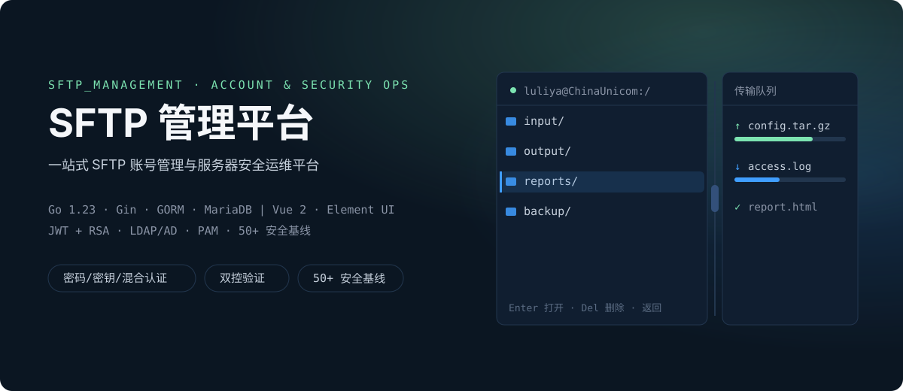
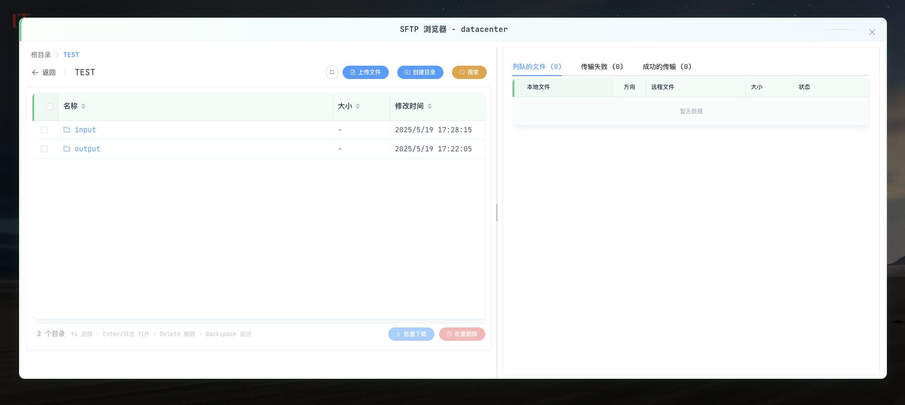
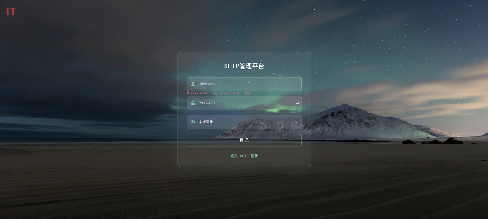
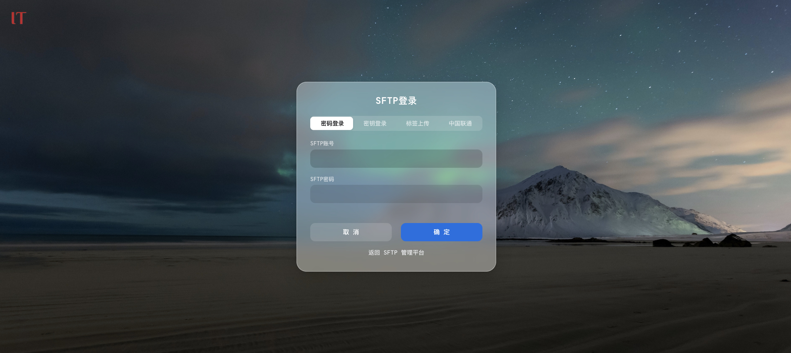
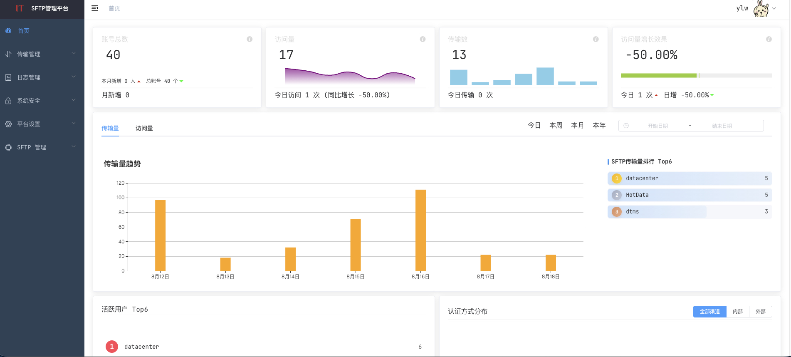
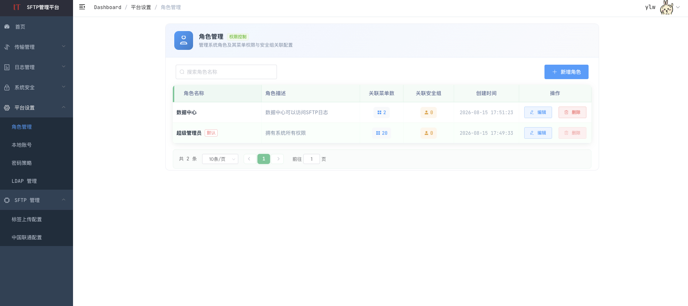
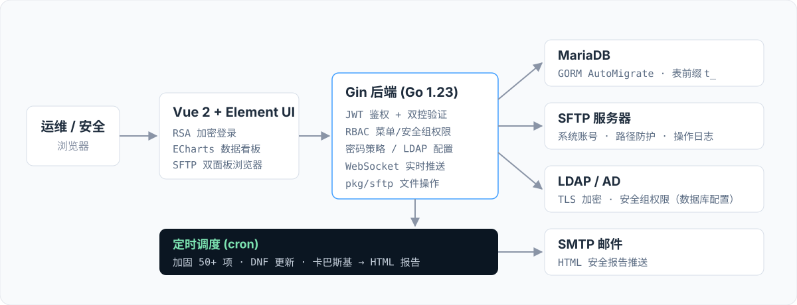

# SFTP 管理平台



> 面向运维与安全团队的一站式平台：SFTP 账号全生命周期管理、安全文件传输、RBAC 权限控制、安全审计与自动化巡检报告。

## 系统截图

**SFTP 浏览器**：双面板布局 + 传输队列，拖拽上传、键盘导航、右键菜单



| 平台登录（磨砂玻璃 + 极光背景） | SFTP 登录（密码/密钥/标签上传/中国联通四通道） |
|:---:|:---:|
|  |  |
| **数据看板（传输量趋势 + Top6 排行）** | **RBAC 角色管理（菜单权限 + 安全组）** |
|  |  |

## 核心能力

### 账号与认证

| 能力 | 说明 |
|------|------|
| **SFTP 账号管理** | 创建/更新/删除/批量删除，支持密码、密钥、混合三种认证方式与密码过期策略 |
| **LDAP/AD 域认证** | TLS 加密连接、安全组权限控制，配置数据库持久化，平台页面可视化管理 |
| **本地 PAM 认证** | RHEL 本地账号 PAM 验证，校验 Shell 合法性 |
| **RBAC 角色权限** | 菜单权限树 + LDAP 安全组绑定，内置超级管理员保护机制 |
| **密码策略** | 最小长度/大小写/数字/特殊字符强制规则，历史密码防复用，过期提醒 |

### 文件传输

| 能力 | 说明 |
|------|------|
| **SFTP 浏览器** | 双面板布局、拖拽上传、键盘导航、右键菜单、递归搜索、批量操作 |
| **传输队列** | 列队/失败/成功三态管理，实时进度、失败重试、批量打包下载 |

### 安全运维

| 能力 | 说明 |
|------|------|
| **系统加固检查** | SSH 配置、密码策略、Cron/At、DNF GPG 校验等 50+ 项安全基线自动巡检 |
| **系统更新管理** | DNF 自动更新，记录状态/耗时/详情，支持历史查看 |
| **卡巴斯基监控** | 采集 Kaspersky Endpoint Security 状态，生成反病毒库/扫描/威胁报告 |
| **安全报告推送** | 加固/更新/卡巴斯基报告定时生成，HTML 邮件推送指定收件人 |
| **操作日志审计** | 登录日志与增删改操作日志，支持时间/用户名模糊检索与分页 |

### 平台基础

| 能力 | 说明 |
|------|------|
| **数据看板** | 近 7 天传输量/访问量趋势、账号总数与月度新增、传输量 Top10 排行 |
| **认证与传输安全** | JWT 鉴权 + 前端密码 RSA 加密传输；敏感操作支持双控验证（如删除账号需第二账号复核） |
| **实时推送** | 后端任务执行状态经 WebSocket 实时推送前端 |
| **实时推送** | 后端任务执行状态经 WebSocket 实时推送前端 |
| **优雅关闭** | 信号监听，等待在途请求处理完毕后停止服务 |

## 快速开始

### 环境要求

- Go >= 1.23、Node.js >= 16
- MariaDB / MySQL
- Linux（SFTP 账号管理依赖 Shell 脚本）

### 启动后端

```bash
cd backend
vim config.yml          # 填写 database / email / jwt 等配置段
go build -o sftpbackend .
./sftpbackend           # 默认监听 :8888
```

首次启动时 GORM AutoMigrate 自动建表，并初始化默认数据（密码策略、调度任务、管理员账号），无需手动执行 SQL。

### 启动前端

```bash
cd frontend
npm install
npm run dev             # 默认监听 :9529
```

### 首次登录

- 默认管理员账号：`admin` / `admin1234567890.`（首次登录后请立即修改密码）
- 登录密码经 RSA 加密传输：前端通过 `GET /rsa/public-key` 动态加载公钥并加密，不再硬编码在前端代码中
- 支持 LDAP/AD 与本地账号两种登录通道
- 涉及账号删除等敏感操作时，平台会触发双控验证（第二账号复核）

## 系统架构



- **后端**：Go 1.23 · Gin · GORM · gorilla/websocket · go-ldap · pkg/sftp · robfig/cron
- **前端**：Vue 2 · Element UI · ECharts · JSEncrypt · dayjs

## RSA 公钥说明

### 架构变化

本次更新将前端 RSA 公钥从硬编码方式改为从后端 API 动态获取，主要变更包括：

#### 前端改造

- **动态加载公钥**: 通过 `GET /rsa/public-key` 接口获取标准 PEM 格式公钥
- **缓存机制**: 首次加载后缓存在内存中，避免重复网络请求
- **异步加密模式**: 所有密码字段加密改为异步 (`await rsaEncrypt()`) 处理
- **Promise 优化**: 并发请求共享同一个 loading Promise，无内存泄漏风险

#### 后端新增

- **API 端点**: `GET /rsa/public-key` - 返回标准 X.509 PKIX PEM 格式公钥
- **线程安全**: 使用 RWMutex 保护 RSA 操作，防止并发竞态条件
- **类型验证**: 显式检查公钥是否为 RSA 类型，防止非 RSA 公钥导致加密失败
- **错误脱敏**: API 错误消息不泄露敏感信息，详细日志记录到服务器 logs

#### 安全优势

✅ **密钥轮换无需重新编译**: 修改私钥/公钥后只需重启后端，前端自动同步新公钥  
✅ **符合 DevOps 最佳实践**: 密钥配置与应用代码分离，便于自动化部署  
✅ **X.509 标准兼容**: 遵循 RFC 8017 标准，支持多种加密库和工具链  
✅ **加密算法**: 前端使用 RSA-OAEP 加密，后端支持 PKCS1v15 解密  

#### 兼容性

- ✅ 向后兼容旧的前端版本（硬编码公钥降级方案已实现）
- ⚠️ 建议所有前端组件统一使用 `await rsaEncrypt()` 异步加密模式
- 📝 浏览器兼容性：依赖 ES6 Promise + async/await，目标环境需支持（IE11 需 polyfill）

更多信息见:
- [`frontend/src/utils/encrypt.js`](frontend/src/utils/encrypt.js) - 前端 RSA 加密核心代码
- [`backend/tools/rsa.go`](backend/tools/rsa.go) - 后端 RSA 工具函数
- [`backend/controller/rsa_controller.go`](backend/controller/rsa_controller.go) - RSA 公钥接口控制器

## 配置说明

`backend/config.yml` 配置段：

| 配置段 | 说明 |
|--------|------|
| `system` | 监听端口、运行模式、RSA 私钥路径、加密私钥路径 |
| `database` | MariaDB 连接信息、表前缀、编码方式 |
| `sftp_account` | 专用 SFTP 账号（标签上传/中国联通等模块共用） |
| `hotlabel` / `chinaunicom` | 各业务模块允许访问的根路径限制 |
| `email` | SMTP 发送配置（含 HTML 正文模板） |
| `jwt` | Token 密钥、过期时间、签发人 |
| `script` | Shell 脚本路径（用户管理/系统检查/文件统计） |
| `logfiles` | SFTP 日志路径（总日志 + 每日切割文件） |
| `scheduler` | 计划任务初始 Cron 表达式（卡巴斯基/系统更新/加固检查） |

> LDAP 服务器地址、Base DN、TLS 证书与安全组等配置已迁移至数据库管理，在「平台设置 → LDAP 管理」页面维护，不再占用配置文件段。

## SFTP 浏览器

平台核心文件传输组件，提供专业级文件管理体验：

- **双面板布局**：左侧文件列表（动态高度、磨砂玻璃风格），右侧传输队列（列队/失败/成功三标签页），分隔线可拖拽调整与折叠
- **上传下载**：多文件批量上传、拖拽上传、右键选定上传、多选打包下载、单文件快速下载
- **搜索**：当前目录即时过滤 + 指定路径递归搜索，骨架屏防跳动
- **键盘导航**：↑↓ 循环聚焦、Enter/双击打开、Delete 删除、Backspace 返回上级、Tab 切换焦点
- **右键菜单**：下载/重命名/删除/复制文件名；队列选定上传/移除/清空；失败单个或全部重试

## 安全基线

系统加固模块内置 50+ 项检查标准，覆盖 SSH 配置、密码策略、Cron/At 任务、DNF GPG 校验、系统加密策略等，检查项定义见 [backend/models/systemcheck.go](backend/models/systemcheck.go)，巡检结果可生成 HTML 报告邮件推送。

## License

MIT
